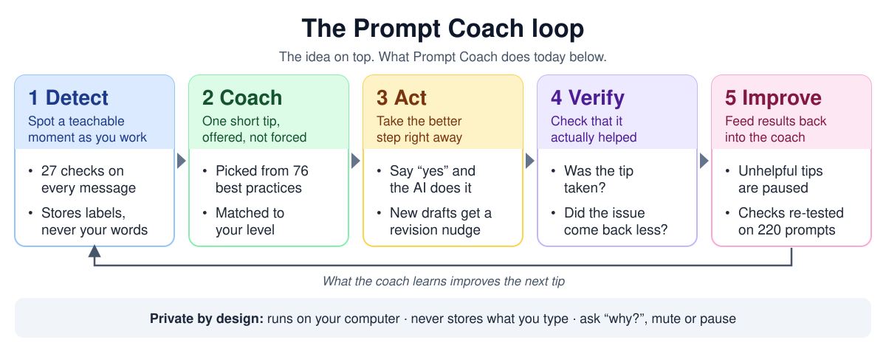

# Prompt Coach

[](https://github.com/amrogers2007/prompt-coach/actions/workflows/test.yml)

**A coach that lives inside Claude and teaches you to use AI well, while you work.**

Prompt Coach is a plugin for Claude: the desktop app and Claude Code. It doesn't rewrite your prompts. It spots a
teachable moment, offers one short tip, and if you say yes, the AI does the better step with you. What it learns
about your habits stays on your computer, where it becomes an **AI Fluency level** and a private dashboard that
shows how your habits change.

Built by Amanda Rogers (CS + Physics, Harvey Mudd) as a self-directed project: take a real idea from user
interviews to a working, tested product.

```
You:    write an email about the office move
Claude: (writes the email)
        ...
        *Prompt Coach: Knowing who will read this would sharpen the tone. Who is it for?*
```

## Install

```bash
claude plugin marketplace add amrogers2007/prompt-coach
claude plugin install prompt-coach@prompt-coach
```

That covers Claude Code and the desktop app's Code tab. To coach in the desktop app's regular chat as well, follow
the short setup in [`coach/README.md`](coach/README.md#install). Requires Python 3.9 or newer; nothing else to
install.

## How it works



| Step | What Prompt Coach does |
|---|---|
| **1. Detect** | 27 checks spot moments like a missing audience or an unchecked number. Only labels are stored. |
| **2. Coach** | Offers one short tip, after the answer, from a [library of 76 best practices](coach/library/recommendations.md). |
| **3. Act** | If you say "yes", the AI does the better step with you, such as asking who your reader is. |
| **4. Verify** | Tracks whether tips are taken and whether the issue comes back less often. |
| **5. Improve** | Pauses tips people keep turning down. Re-tests the checks on every change. |

You also get:

- **An AI Fluency level** (Beginner, Practitioner, Advanced, Expert) based on what you do, not a quiz.
- **A private dashboard** of your habits over time, with goals, a weekly recap, and badges.
- **Control:** ask why a tip appeared, mute it, pause the coach, or turn it off.
- **Privacy:** the coach runs on your computer and never stores what you type.

## What's in this repo

| Folder | What it is |
|---|---|
| [`coach/`](coach/) | The plugin: hooks, skills, the coach agent, the recommendation library, and 200+ automated tests (Python, standard library only). |
| [`docs/`](docs/) | Why it works the way it does: the coaching loop, design notes, user interviews, and the research behind the library. |
| [`install/`](install/) | Guided installers for macOS, Linux and Windows. |

## Documents

- [COACHING-LOOP.md](docs/COACHING-LOOP.md): the problem, the loop, and how it's tested. Start here.
- [COACH-DESIGN.md](docs/COACH-DESIGN.md): design decisions and what's still open.
- [BEST-PRACTICES-SOURCE.md](docs/BEST-PRACTICES-SOURCE.md): the research table many recommendations came from.
- [INTERVIEW-NOTES.md](docs/INTERVIEW-NOTES.md): early user interviews and the pain points they surfaced.
- [GLOSSARY.md](docs/GLOSSARY.md): plain-English definitions of startup and business terms.
- [history/](docs/history/): early planning notes, kept for the record.

## Status

Working and tested. The plugin runs in Claude Code and in the Claude desktop app's chat, both confirmed by hand on
Windows. How accurately it spots teachable moments is measured against 220 labeled prompts, and the results,
including the weaker blind-test scores, are in [COACHING-LOOP.md](docs/COACHING-LOOP.md).

Not done yet: a pilot with real users. That's the next step.

Released under the MIT license.
